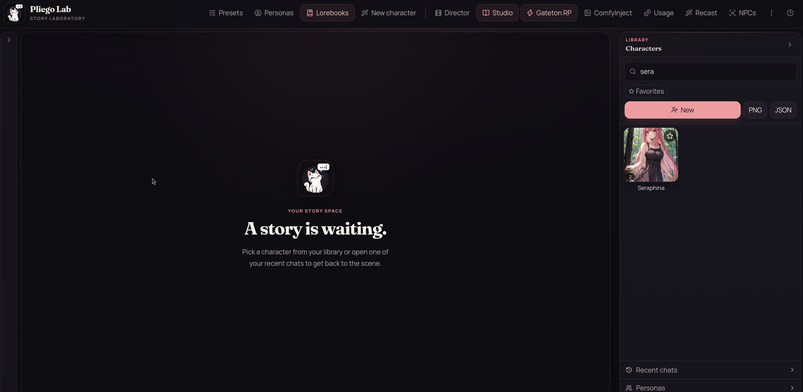
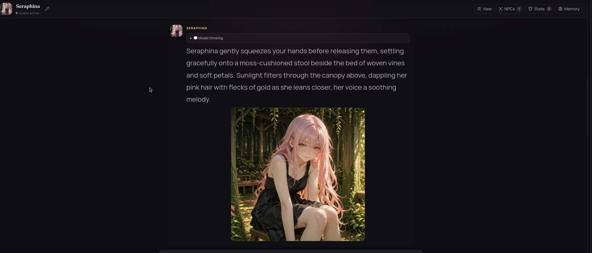
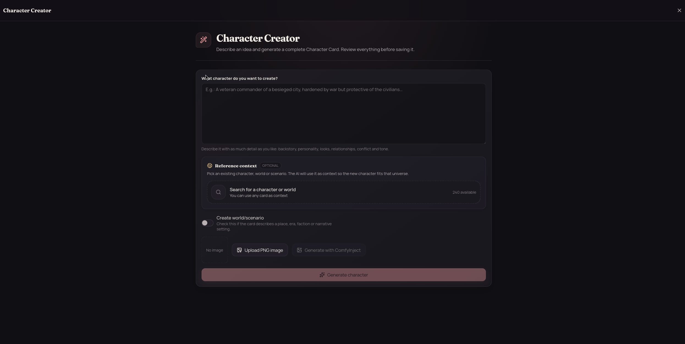
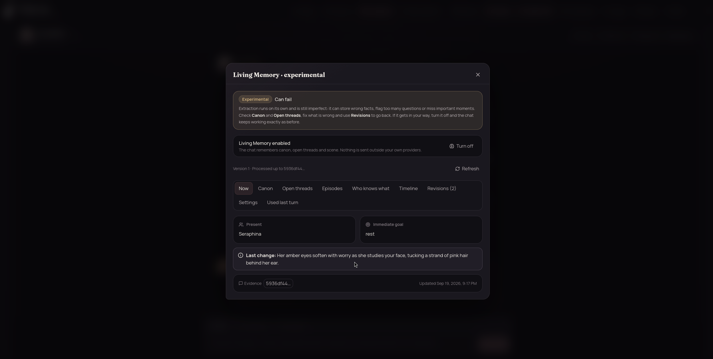
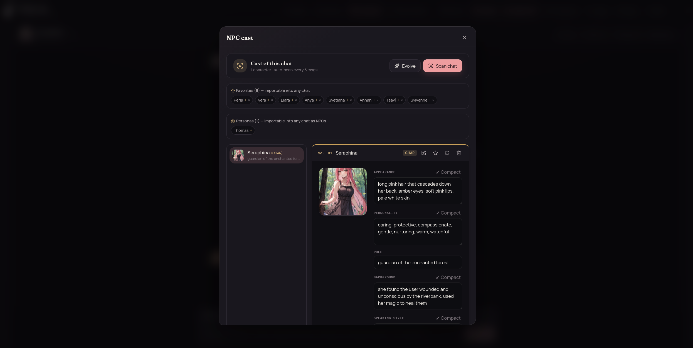
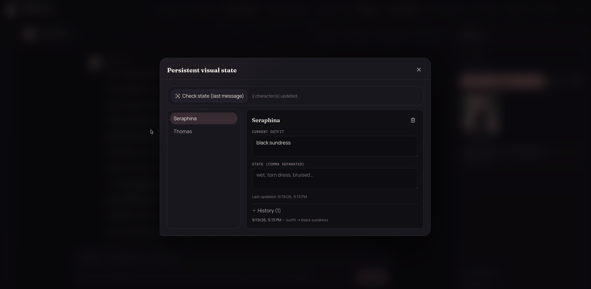

<p align="center">
  
</p>

<h1 align="center">Pliego Lab</h1>

<p align="center"><strong>A local workspace for interactive storytelling.</strong></p>

<p align="center">
  <a href="README.md">English</a> · <a href="README.es.md">Español</a>
</p>

<p align="center">
  <a href="https://github.com/Gateton/Pliego-Lab/actions/workflows/ci.yml"></a>
  <a href="LICENSE"></a>
  
</p>

> Early-stage software. Expect unfinished areas and breaking changes while the project evolves.

## Screenshots

<p align="center">
  
  
</p>

<p align="center">
  
  
</p>

These screenshots show the main workspace, a chat with an image, character creation, and narrative continuity tools. The strongest differentiators are highlighted below so the repository front page can show the parts of Pliego Lab that go beyond a conventional chat frontend.

## What is Pliego Lab?

Pliego Lab is a local, single-user web application for roleplay and interactive fiction. It brings characters, personas, lore, prompt control, continuity tools, optional image generation, and multiple LLM providers into one focused workspace.

Your chats and configuration remain on your machine by default. When you generate a response, the prompts and context selected for that request are sent to the provider you configure. Pliego Lab does not require SillyTavern to run, but it supports practical imports from SillyTavern formats so you can bring existing characters and related content with you.

## Why Pliego Lab?

Most chat frontends stop at generating a response. Pliego Lab treats a scene as a living visual and narrative state:

- **Director** decides when prose needs an image and turns the moment into a structured visual prompt.
- **NPC Tracker** remembers recurring secondary characters as editable dossiers instead of disposable context.
- **Persistent Visual State** carries outfits and durable physical conditions across generations.
- **ComfyInject** renders the resulting scene through local ComfyUI workflows.

Together, these features connect narrative context, cast continuity, and image generation in one local workspace.

## What it includes

### Story workspace

- Character cards, personas, chats, branches, swipes, regeneration, editing, and continuation.
- Lorebooks and world information for enriching prompts.
- NPC tracking and scene-building tools.
- Memoria Viva for experimental narrative continuity and canon tracking.

<p align="center">
  
</p>

### Generation control

- Prompt Manager with ordered blocks, injection positions, roles, and token counts.
- Response presets for models, sampling, context, reasoning, and provider compatibility.
- Recast for multi-pass prose processing with reviewable diffs.
- Providers for OpenRouter, OpenAI, Anthropic, Google Gemini, OpenAI-compatible services, and custom endpoints.

## Feature highlights

### Director

**Director** is Pliego Lab's visual direction layer. A secondary model reads the generated prose, identifies moments worth illustrating, and inserts structured image markers without making the main chat model responsible for visual prompting.

It can:

- Place images at scene-appropriate moments and limit the number of images per turn.
- Build structured prompts from characters, personas, NPCs, recent messages, and visual history.
- Preserve identity anchors such as hair, eyes, face, skin, body, and species.
- Support automatic generation, manual `/img` NPC reaction shots, diagnostics, and cancellation.
- Hand the resulting markers to ComfyInject for rendering through local ComfyUI workflows.

<p align="center">
  
</p>

### NPC Tracker

**NPC Tracker** turns recurring secondary characters into a living cast. It detects named NPCs from the conversation and maintains an editable dossier for each one instead of treating every appearance as disposable context.

It can:

- Scan conversations automatically, manually, or with local heuristics.
- Track appearance, personality, role, background, speech style, motivations, secrets, mannerisms, and narrative limits.
- Evolve dossiers over time using append or replace behavior.
- Consolidate fields, regenerate dossiers, favorite NPCs, and import them into other chats.
- Generate NPC portraits through ComfyInject and match portraits using names or image tags.
- Support custom, reorderable dossier fields and optional main-character tracking.

<p align="center">
  
</p>

### Persistent Visual State

**Persistent Visual State** keeps visual continuity between generations. It records the current outfit and durable physical conditions for each character, then feeds that state back into Director so a character does not silently change clothes, injuries, or appearance from image to image.

It can:

- Establish an outfit baseline when a character first appears.
- Detect outfit changes and durable conditions such as wet, dirty, injured, bruised, sweaty, or disheveled.
- Remove stale or resolved conditions instead of accumulating contradictions.
- Represent dressed, nude, and partial-clothing states explicitly.
- Keep removed clothing out of later generated tags.
- Expose a manual editor, timestamped history, record deletion, and a standalone audit pass.

<p align="center">
  
</p>

### Visual direction

- ComfyInject turns image markers into ComfyUI generations.
- Local workflow configuration, image galleries, and retry controls.
- Image Director, NPC Tracker, and Persistent Visual State work together as a visual continuity pipeline rather than isolated image buttons.

### Compatibility and interface

- Import of characters, presets, personas, and lorebooks from compatible SillyTavern formats.
- Spanish and English interface catalogs.
- Responsive layout, themes, onboarding, and a minimal runtime plugin foundation.
- Optional Estudio features for writing voice and user-defined rules.

Pliego Lab is intentionally smaller and more opinionated than SillyTavern. It is not a fork, does not bundle SillyTavern, and does not aim to reproduce its extension ecosystem.

## Requirements

- Node.js 20 or newer.
- npm.
- An API key for a supported text provider.
- ComfyUI at `http://127.0.0.1:8188` only if you want local image generation.

## Quick start

### Linux and macOS

```bash
./start.sh
```

### Windows

```bat
start.bat
```

The launcher checks Node.js, installs dependencies when needed, builds the frontend and backend, starts the application at `http://localhost:3001`, and opens the browser. You can configure providers from the application or provide backend environment settings first.

## Development

Install and run the backend:

```bash
cd backend
npm install
npm run dev
```

In a second terminal, install and run the frontend:

```bash
cd frontend
npm install
npm run dev
```

The Vite development server proxies `/api` to the local backend. For validation, run:

```bash
cd backend
npm test
npm run build

cd ../frontend
npm run i18n:check
npm run lint
npm run build
```

The backend listens on `127.0.0.1` by default. Do not expose it directly to the Internet. If you change the host, place the application behind appropriate authentication, access control, and network isolation.

## Data and privacy

Local application data is stored under `backend/data/`, including chats, characters, personas, presets, lorebooks, and settings. Keep this directory out of version control and back it up before major changes.

Provider credentials are handled by the backend and are not sent to the frontend. Prompts may contain chat messages, character data, lorebooks, or continuity context, depending on the request. Review the policies of every provider you configure.

Read [`PRIVACY.md`](PRIVACY.md) for data-flow details and [`SECURITY.md`](SECURITY.md) before exposing any local service.

## Documentation and community

- [`CONTRIBUTING.md`](CONTRIBUTING.md) — local development and pull requests.
- [`SECURITY.md`](SECURITY.md) — responsible vulnerability reporting and security guidance.
- [`PRIVACY.md`](PRIVACY.md) — local storage and external data flow.
- [`THIRD_PARTY_NOTICES.md`](THIRD_PARTY_NOTICES.md) — dependencies, integrations, and attribution notes.
- [`CODE_OF_CONDUCT.md`](CODE_OF_CONDUCT.md) — community expectations.
- [`docs/COMMUNITY_CONTENT_POLICY.md`](docs/COMMUNITY_CONTENT_POLICY.md) — guidance for public issues, examples, and screenshots.
- [`docs/`](docs/) — technical design and implementation documentation.

Use GitHub Issues for bug reports and feature requests. Do not include API keys, private chats, personal images, or files from `backend/data/` in issues or pull requests.

## License and branding

The Pliego Lab source code is licensed under the [Apache License 2.0](LICENSE). The license does not grant permission to use the Pliego Lab name, logo, or visual identity to imply endorsement or official status.

Third-party dependencies, providers, ComfyUI, models, workflows, imported material, and user-created content remain subject to their own terms. See [`THIRD_PARTY_NOTICES.md`](THIRD_PARTY_NOTICES.md).
